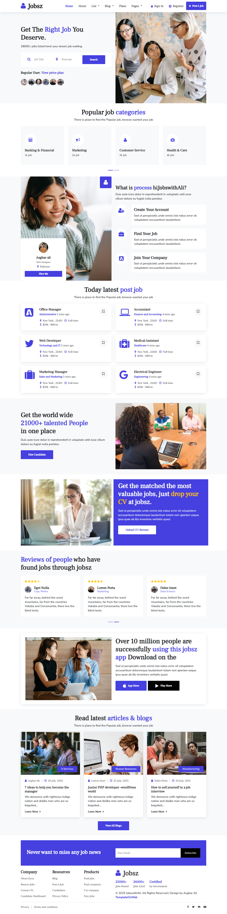
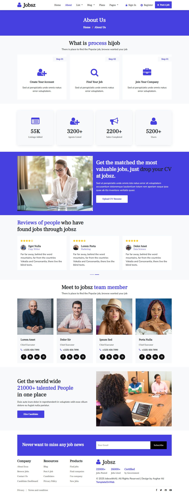
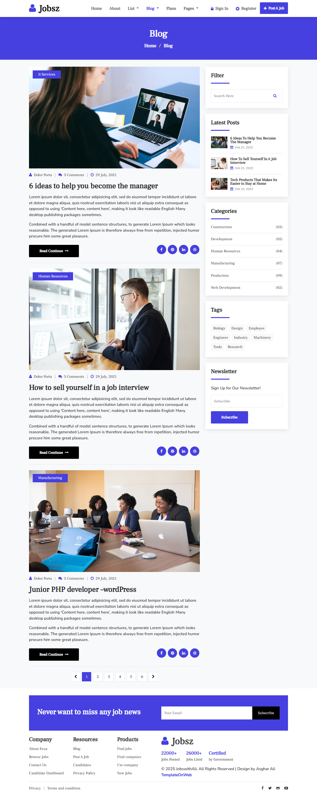
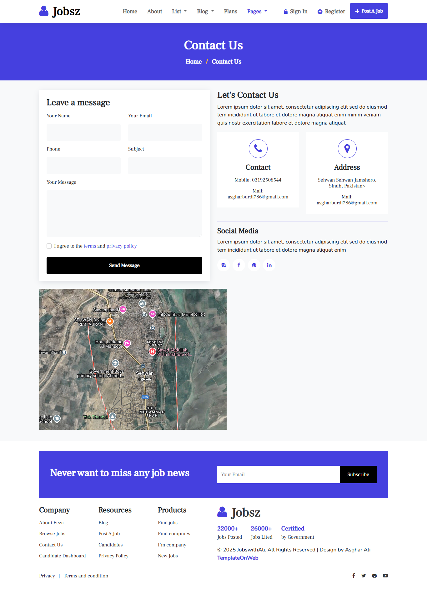
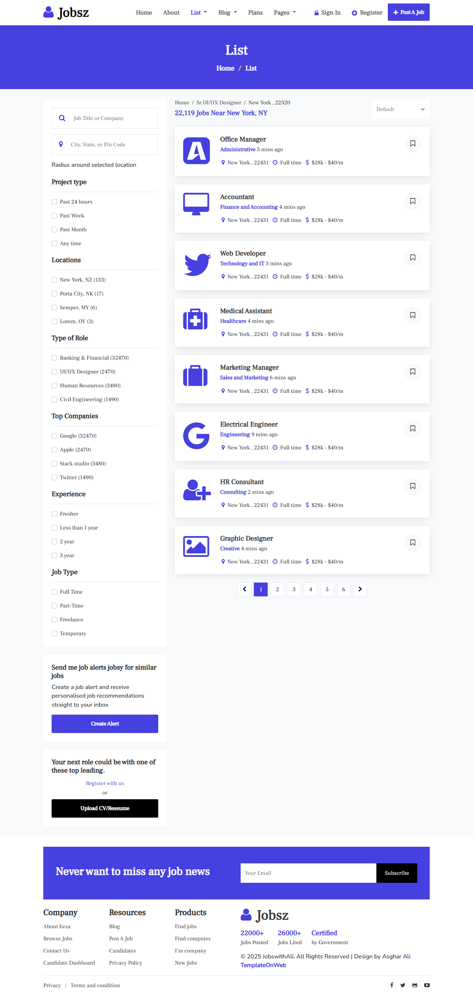
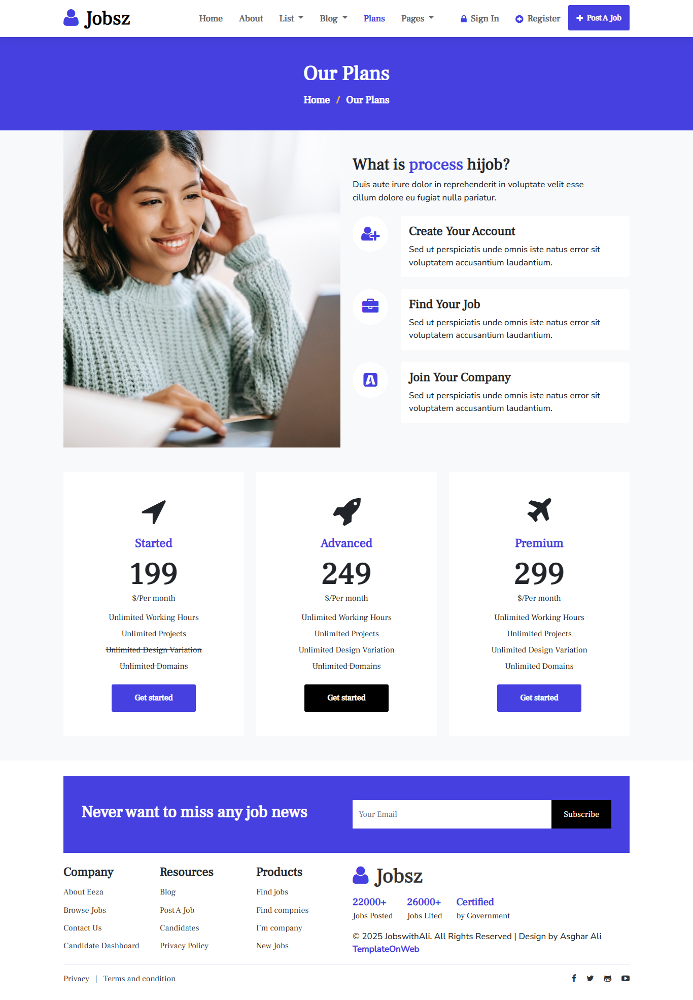

# Tailwind E-commerce

Find your Job Now.Use this theme from asghar dev suitable for your job <br>

## Templates Preview

<details open="true"><summary><strong>Homepage</strong></summary><br>

</details>

<details><summary><strong>About</strong></summary><br>

</details>

<details><summary><strong>Blog overview</strong></summary><br>

</details>

<details><summary><strong>contact page</strong></summary><br>

</details>

<details><summary><strong>List</strong></summary><br>

</details>

<details><summary><strong>Plan</strong></summary><br>

</details>

## Getting started

1. Clone the project

```
git clone https://github.com/asgharali101/Jobsz-web
```

2. Install the dependencies:

```
npm install
```

3. Run the project

```
# Start server
npm run start

# or Build
npm run build
```

## Live demo

Check the live demo here: [https://tailwind-ecommerce-demo.vercel.app/](https://tailwind-ecommerce-demo.vercel.app/)

## License

[The MIT License (MIT)](https://github.com/asgharali101/Ali-commerce/blob/main/LICENSE)
